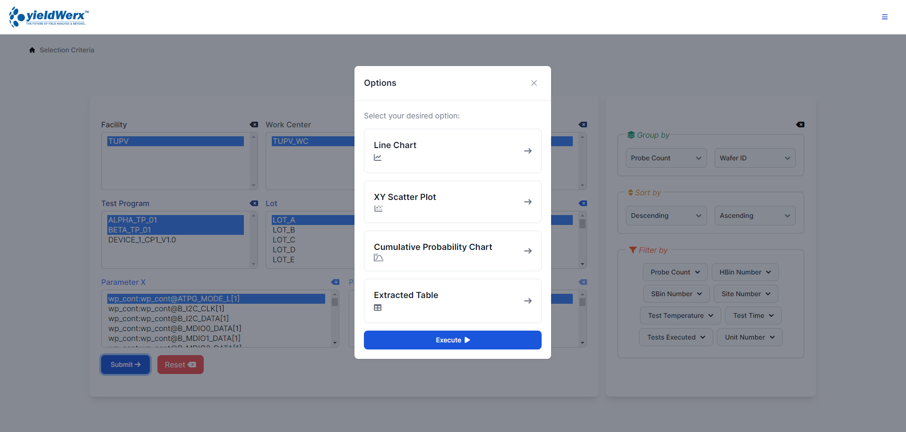
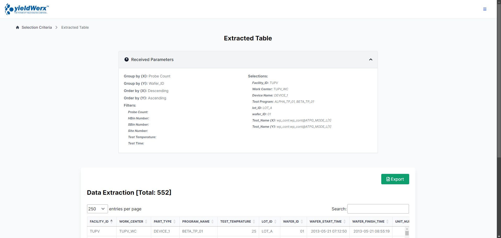
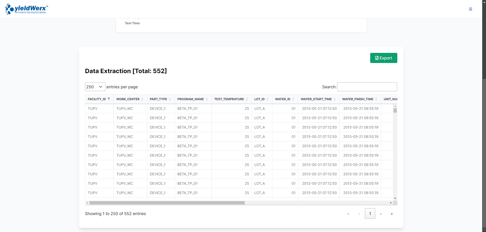
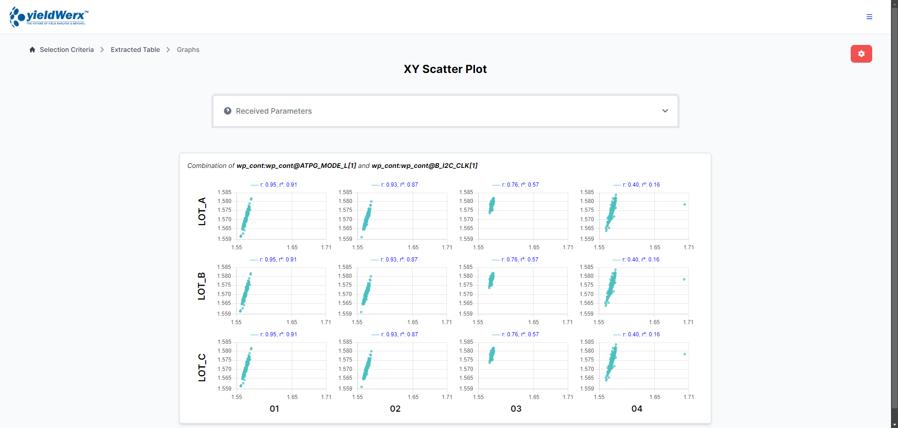
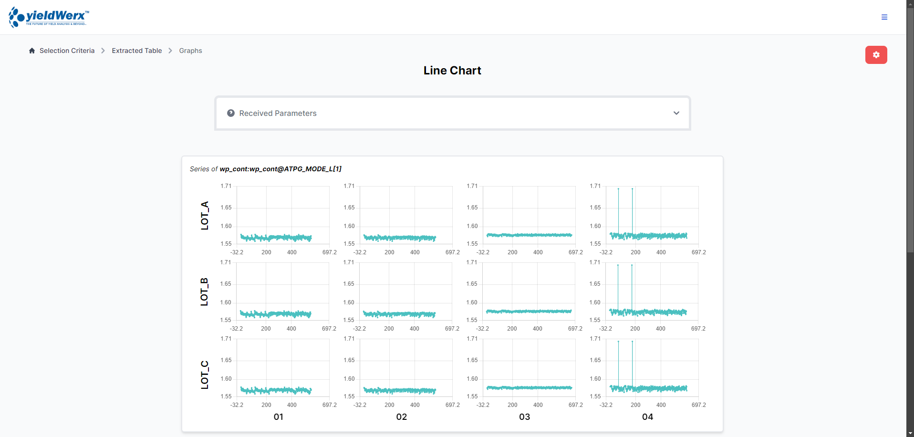
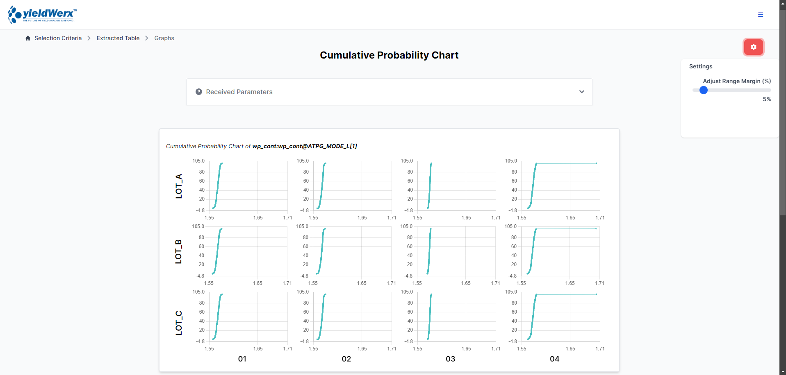
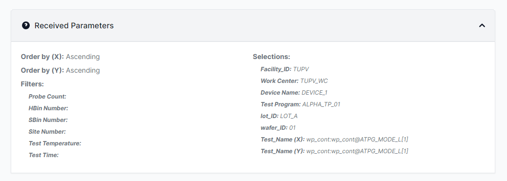
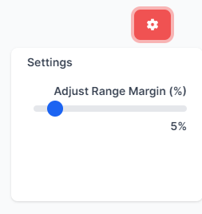
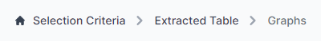
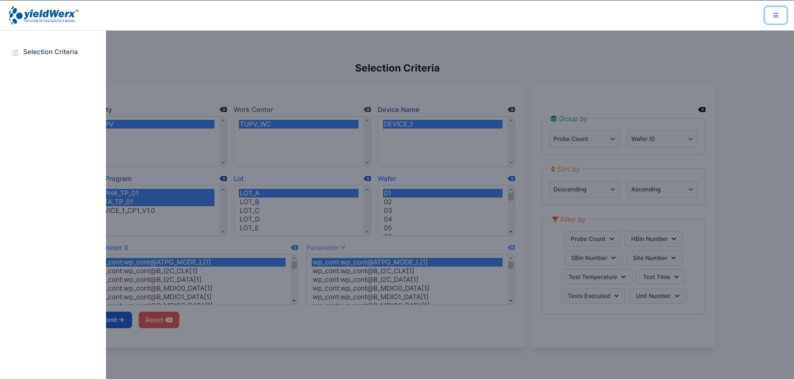

# YieldWerx Data Extraction and Analytics System

## Table of Contents
- [Introduction](#introduction)
- [Features](#features)
- [Languages and Tools](#languages-and-tools)
  - [Frontend](#frontend)
  - [Backend](#backend)
  - [Database](#database)
  - [Tools](#tools)
- [Requirements](#requirements)
- [Installation Steps](#installation-steps)
  - [Step 1: Connect PHP to Microsoft SQL Server](#step-1-connect-php-to-microsoft-sql-server)
  - [Step 2: Match PHP version with `php_pdo_sqlsrv` and `php_sqlsrv`](#step-2-match-php-version-with-php_pdo_sqlsrv-and-php_sqlsrv)
  - [Step 3: Transfer `php_pdo_sqlsrv` and `php_sqlsrv` files to PHP ext folder](#step-3-transfer-php_pdo_sqlsrv-and-php_sqlsrv-files-to-php-ext-folder)
  - [Step 4: Insert files as extensions in `php.ini`](#step-4-insert-files-as-extensions-in-phpini)
  - [Step 5: Establish connection in VS Code](#step-5-establish-connection-in-vs-code)
  - [Step 6: Clone the repository](#step-6-clone-the-repository)
  - [Step 7: Install dependencies](#step-7-install-dependencies)
  - [Step 8: Add database information in `.env` file](#step-8-add-database-information-in-env-file)
  - [Step 9: Launch the frontend](#step-9-launch-the-frontend)
  - [Step 10: Visit the application](#step-10-visit-the-application)
- [UI Screenshots](#ui-screenshots)
  - [Dashboard](#dashboard)
  - [Charts and Graphs](#charts-and-graphs)
  - [Data Tables](#data-tables)
  - [Responsive Design](#responsive-design)

## Introduction
Welcome to the YieldWerx Data Extraction and Analytics System, designed to streamline data processing and analysis with an emphasis on maintainability, performance, and user experience.

# Features
- Utilizes the Repository Pattern and Services for maintainability
- Follows clean code and Separation of Concerns principles
- Optimizes database performance by avoiding the N+1 problem.
- Implements a responsive design to ensure a good user experience on all devices
- Uses reusable components and layouts to avoid duplication of code
- utilizes charts and graphs to ensure that users can easily understand the information presented
- features a simple design to ensure easy navigation for users

# Languages and Tools
## Frontend
- Tailwind CSS 3
- Flowbite
- HTML

## Backend
- PHP 8
- Javascript

## Database
- MSSQL

## Tools
- Git
- Github
- ODBC driver
- Microsoft Drivers for PHP for SQL Server
- Composer
- XAMPP
- SQL Server Management Studio 20
 
## Requirements
- Node.js
- Composer
- PHP 8
- ODBC driver
- Microsoft Drivers for PHP for SQL Server
- XAMPP
- SQL Server Management Studio 20

### Installation Steps
1. Connect PHP to Microsoft SQL Server

   ``` bash
   https://www.youtube.com/watch?v=XLTkcB_T8Mo
   ```
   
2. Make sure the PHP version matches the php_pdo_sqlsrv and php_sqlsrv
   
   
   
 

3. Transfer php_pdo_sqlsrv and php_sqlsrv files to php ext folder
   
    
    
   
   
5. Insert the files as extension in php.ini
 
 
 

5. Establish connection in VS Code


6. Clone the repository inside C:\xampp\htdocs\

   ```bash
   git clone https://github.com/naaivvv/yieldWerx_OJT2024
   ```

7. Install the dependencies

   ```bash
   composer install
   ```

   ```bash
   npm install
   ```
   
8. In the (.env file), add database information to connect to the database

   ```env
   DB_SERVERNAME=SERVERNAME/SQLEXPRESS
   DB_DATABASE=yielWerx_OJT2024
   DB_USERNAME=
   DB_PASSWORD=
   ```
   
9. Launch the frontend asset of the system

   ```bash
   npm run dev
   ```

10. Visit the application

    ```bash
    http://localhost/yieldwerx_OJT2024/PHP/
    ```
# UI Screenshots

## Selection Criteria


- **Functionality:** Allows users to define specific criteria for data extraction. The selection process involves filtering data based on parameters such as wafer IDs, probe counts, product types, or any specific test conditions. This feature ensures that the extracted data is relevant and meets the user's analysis needs.

## Extracted Table


- **Functionality:** Presents the data extracted based on the selection criteria in a structured tabular format. Users can view detailed records, perform sorting, apply filters, and manage pagination. This table serves as the central location for reviewing the raw data before it is analyzed or visualized.

## Graphs
### Overview
- **Functionality:** Provides visual representations of the extracted data, enabling users to easily interpret complex datasets. The system offers various types of charts and graphs to suit different analytical needs.

### XY Scatter Plot

- **Functionality:** Visualizes the relationship between two variables across the dataset. This plot is ideal for identifying correlations, trends, and outliers within the data.

### Line Chart

- **Functionality:** Depicts trends over time or across sequential data points. The line chart is particularly useful for tracking changes in key metrics, allowing users to observe patterns and predict future outcomes based on historical data.

### Cumulative Probability Chart

- **Functionality:** Displays the cumulative probability distribution of a dataset. This chart helps users understand the probability of different outcomes occurring within a range of values, providing insights into the overall data distribution and the likelihood of specific results.

## Additional UI

### Received Parameters

- **Functionality:** Lists the parameters that have been selected or input by the user during the data extraction process. This section provides a summary of the choices made, ensuring that users can easily verify the criteria used for data filtering and extraction.

### Chart Settings for Adjusting Chart Margin

- **Functionality:** Offers users the ability to customize chart margins and other visual settings. By adjusting these parameters, users can refine the display of charts to better fit their analysis needs, ensuring clarity and enhancing the visual presentation of data.

### Breadcrumbs and Navigation Bar


- **Functionality:** Enhances user navigation by providing a clear pathway of the current page's location within the system. Breadcrumbs help users track their navigation history, while the navigation bar offers quick access to different sections of the application, promoting ease of use and efficient workflow management.
