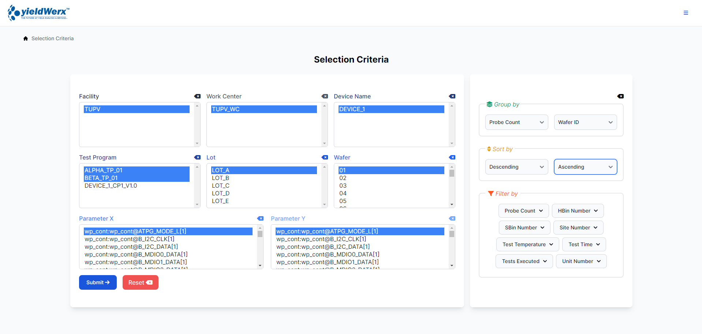

# YieldWerx Data Extraction and Analytics System

## Table of Contents
- [Introduction](#introduction)
- [Features](#features)
- [Languages and Tools](#languages-and-tools)
  - [Frontend](#frontend)
  - [Backend](#backend)
  - [Database](#database)
  - [Tools](#tools)
- [Requirements](#requirements)
- [Installation Steps](#installation-steps)
  - [Step 1: Connect PHP to Microsoft SQL Server](#step-1-connect-php-to-microsoft-sql-server)
  - [Step 2: Match PHP version with `php_pdo_sqlsrv` and `php_sqlsrv`](#step-2-match-php-version-with-php_pdo_sqlsrv-and-php_sqlsrv)
  - [Step 3: Transfer `php_pdo_sqlsrv` and `php_sqlsrv` files to PHP ext folder](#step-3-transfer-php_pdo_sqlsrv-and-php_sqlsrv-files-to-php-ext-folder)
  - [Step 4: Insert files as extensions in `php.ini`](#step-4-insert-files-as-extensions-in-phpini)
  - [Step 5: Establish connection in VS Code](#step-5-establish-connection-in-vs-code)
  - [Step 6: Clone the repository](#step-6-clone-the-repository)
  - [Step 7: Install dependencies](#step-7-install-dependencies)
  - [Step 8: Add database information in `.env` file](#step-8-add-database-information-in-env-file)
  - [Step 9: Launch the frontend](#step-9-launch-the-frontend)
  - [Step 10: Visit the application](#step-10-visit-the-application)
- [UI Screenshots](#ui-screenshots)
  - [Dashboard](#dashboard)
  - [Charts and Graphs](#charts-and-graphs)
  - [Data Tables](#data-tables)
  - [Responsive Design](#responsive-design)

## Introduction
Welcome to the YieldWerx Data Extraction and Analytics System, designed to streamline data processing and analysis with an emphasis on maintainability, performance, and user experience.

# Features
- Utilizes the Repository Pattern and Services for maintainability
- Follows clean code and Separation of Concerns principles
- Optimizes database performance by avoiding the N+1 problem.
- Implements a responsive design to ensure a good user experience on all devices
- Uses reusable components and layouts to avoid duplication of code
- utilizes charts and graphs to ensure that users can easily understand the information presented
- features a simple design to ensure easy navigation for users

# Languages and Tools
## Frontend
- Tailwind CSS 3
- Flowbite
- HTML

## Backend
- PHP 8
- Javascript

## Database
- MSSQL

## Tools
- Git
- Github
- ODBC driver
- Microsoft Drivers for PHP for SQL Server
- Composer
- XAMPP
- SQL Server Management Studio 20
 
## Requirements
- Node.js
- Composer
- PHP 8
- ODBC driver
- Microsoft Drivers for PHP for SQL Server
- XAMPP
- SQL Server Management Studio 20

### Installation Steps
1. Connect PHP to Microsoft SQL Server

   ``` bash
   https://www.youtube.com/watch?v=XLTkcB_T8Mo
   ```
   
2. Make sure the PHP version matches the php_pdo_sqlsrv and php_sqlsrv
   
   
   
 

3. Transfer php_pdo_sqlsrv and php_sqlsrv files to php ext folder
   
    
    
   
   
5. Insert the files as extension in php.ini
 
 
 

5. Establish connection in VS Code


6. Clone the repository inside C:\xampp\htdocs\

   ```bash
   git clone https://github.com/naaivvv/yieldWerx_OJT2024
   ```

7. Install the dependencies

   ```bash
   composer install
   ```

   ```bash
   npm install
   ```
   
8. In the (.env file), add database information to connect to the database

   ```env
   DB_SERVERNAME=SERVERNAME/SQLEXPRESS
   DB_DATABASE=yielWerx_OJT2024
   DB_USERNAME=
   DB_PASSWORD=
   ```
   
9. Launch the frontend asset of the system

   ```bash
   npm run dev
   ```

10. Visit the application

    ```bash
    http://localhost/yieldwerx_OJT2024/PHP/
    ```
# UI Screenshots
## Selection Criteria

- Functionality: Displays an overview of system metrics and quick access to key features.
